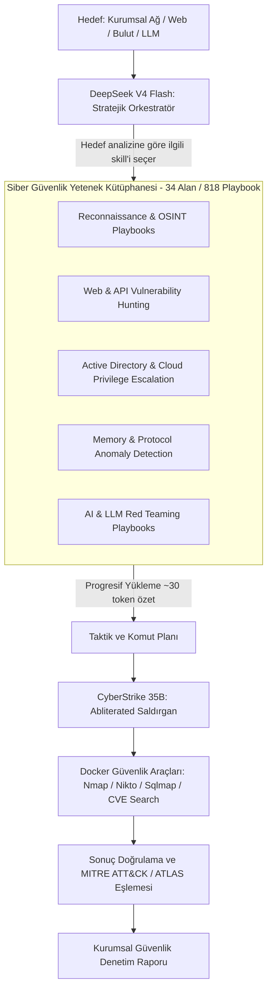

# 🛡️ AutoRedTeam — Siber Güvenlik Yetenek Kütüphanesi ve İleri Düzey (0-Day / N-Day) Keşif Mimarisi

> **Belge Amacı:** AutoRedTeam'in yalnızca bilinen hedeflerle (Metasploitable2 vb.) sınırlı kalmayıp, kurumsal ağlar, bulut ortamları, web uygulamaları ve sıfır-gün (0-Day / N-Day) zafiyet mantığını analiz edebilen otonom bir akıl yürütme motoruna dönüştürülmesi planı.  
> **İlham Kaynağı:** `mukul975/Anthropic-Cybersecurity-Skills` (818 Yapılandırılmış Yetenek, MITRE ATT&CK v19.1, NIST CSF 2.0).  
> **Tarih:** 2026-09-08  
> **Durum:** Mimari Tasarım ve Yol Haritası (Strategic Roadmap)

---

## 🎯 1. Vizyon: Metasploitable'dan Otonom Kıdemli Pentester'a

Mevcut sistemimiz `Metasploitable2` üzerinde bilinen servis versiyonlarını (`Apache 2.2.8`, `vsftpd 2.3.4`, `Samba 3.0.20`) başarıyla tespit edip raporlayabiliyor. 

Ancak gerçek dünyada hedef sistemler günceldir, WAF ve EDR arkasındadır ve zafiyetler genellikle doğrudan sürüm numarasında değil; **mantıksal tasarım hatalarında (Business Logic Flaws)**, **yetkilendirme açıklarında (IDOR/BOLA)** veya **henüz CVE kaydı açılmamış (0-Day) konfigürasyon zafiyetlerinde** bulunur.

**Yeni Mimari Hedefimiz:**
Modellerimize (CyberStrike 35B ve DeepSeek V4 Flash) ezbere komut çalıştırmak yerine, **818 farklı siber güvenlik yeteneğinden (Skill Playbook)** oluşan yapılandırılmış bir taktik hafıza kazandırmak!



---

## 🧠 2. Modeller Bu Yetenekleri Nasıl Kullanacak? (Progressive Disclosure Mimarisi)

818 yeteneğin tamamını bir modelin prompt'una aynı anda vermek imkansızdır (context window patlar). Bu yüzden **Anthropic & agentskills.io standardı** olan **3 Aşamalı Progresif Yükleme** kullanılacaktır:

1. **Aşama 1: Hafif Tarama (Lightweight Scan ~30 Token):**
   * Model sadece yeteneğin adı (`name`), etiketleri (`tags`) ve 2 satırlık açıklamasını (`description`) görür.
   * Örneğin: `exploiting-active-directory-certificate-services-esc1` -> "ADCS sertifika şablonlarındaki SAN yetki yükseltme açığını analiz eder."
2. **Aşama 2: Şart Tetiklenmesi (When to Use):**
   * Eğer nmap veya nikto çıktısında LDAP (389) veya Kerberos (88) tespit edildiyse, DeepSeek V4 Flash derhal bu skill'in detayını çağırır.
3. **Aşama 3: Tam Playbook Yükleme (Full Workflow 500-1500 Token):**
   * Model yalnızca o an ihtiyaç duyduğu skill'in tam Markdown iş akışını okur:
     * `Prerequisites`: Hangi araçlar gerekli?
     * `Workflow`: Adım 1 nmap NSE, Adım 2 certipy/ldap3, Adım 3 bilet alma.
     * `Verification`: Çıktıda `NTLM hash` veya `TGT` geldi mi?

---

## 🔬 3. 0-Day ve İleri Düzey Zafiyetleri Yakalama Stratejisi

Modelin sadece bilinen CVE'leri değil, bilinmeyen mantıksal açıkları yakalayabilmesi için kütüphaneden eklenecek 5 ana yetenek kümesi:

| Yetenek Kümesi | Kapsanan Konular | 0-Day / İleri Düzey Tespit Yeteneği |
| :--- | :--- | :--- |
| **🌐 API & Web Mantık Hataları** | BOLA, BFLA, GraphQL, SSRF, Deserialization | Sürümden bağımsız yetkilendirme ve parametre manipülasyonu tespiti. |
| **☁️ Bulut & Konteyner Kaçışları** | AWS IAM, Azure Entra ID, K8s RBAC, Docker Socket | Yanlış yapılandırılmış izinler ve yetki yükseltme yolları analizi. |
| **🔑 Kimlik & Active Directory** | Kerberoasting, AS-REP Roasting, Shadow Credentials | Şifresiz/güvensiz kimlik doğrulama zincirlerinin otomatik haritalanması. |
| **🤖 AI & LLM Ajan Zafiyetleri** | Goal Theft, Tool Abuse, Indirect Prompt Injection | AI destekli web uygulamalarında prompt manipülasyonu ile veri çalma. |
| **🔍 Canlı CVE & NVD Korelasyonu** | Canlı NVD 2.0 API, NIST bültenleri, Exploit-DB | 2024-2026 en son yayınlanan güvenlik bültenlerini anlık araştırma. |

---

## 🏗️ 4. Proje Dizin Yapısı (`knowledge_base/`)

Projemizin içine eklenecek yetenek modülü:

```text
knowledge_base/
├── index.json                    # 818 yeteneğin hızlı arama ve indeks haritası
├── frameworks/                   # Standart eşleme tabloları
│   ├── mitre_attack.json         # MITRE ATT&CK v19.1 teknik ID'leri
│   ├── mitre_atlas.json          # AI Sistemleri Tehdit Matrisi
│   └── owasp_top10.json          # Web & LLM standartları
└── skills/                       # Modüler Playbook'lar (SKILL.md)
    ├── web_security/             # SQLi, SSRF, BOLA, Deserialization
    ├── network_recon/            # OSINT, ASN enumeration, Advanced Nmap
    ├── active_directory/         # BloodHound, Kerberos, ADCS
    ├── cloud_security/           # AWS, Azure, GCP audit
    ├── container_security/       # Docker escape, K8s audit
    └── ai_agent_security/        # Prompt injection, Tool poisoning, RAG audit
```

---

## 📋 5. Geliştirme Takvimi ve Entegrasyon Adımları

* [x] **Adım 1:** Metasploitable2 & Juice Shop temel pentest altyapısının doğrulanması (Tamamlandı).
* [x] **Adım 2:** Web Kokpitinin (`assessment_ui.py`) canlı akış ve karar zinciri desteğiyle kurulması (Tamamlandı).
* [ ] **Adım 3:** `knowledge_base/` dizininin oluşturulması ve öncelikli 25 kritik pentest/web/LLM skill'inin port edilmesi.
* [ ] **Adım 4:** DeepSeek V4 Flash sistem promptuna "Yetenek Kütüphanesini Dinamik Okuma ve Yönlendirme" yeteneğinin eklenmesi.
* [ ] **Adım 5:** Rapora MITRE ATT&CK ve MITRE ATLAS teknik kodlarının otomatik işlenmesi.

---

> *Bu belge AutoRedTeam'in yeni nesil otonom siber güvenlik platformu vizyonu için resmi mimari rehberdir.*
