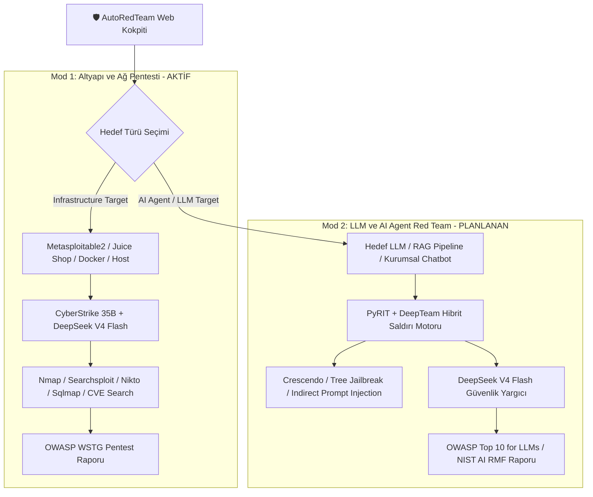

# 🛡️ AutoRedTeam — LLM & AI Agent Red Teaming Geliştirme Yol Haritası (Roadmap)

> **Belge Amacı:** AutoRedTeam platformunun 2. Büyük Evresi olan **"LLM, RAG ve AI Agent Red Teaming"** modülünün mimari tasarımı, DeepTeam ve Microsoft PyRIT karşılaştırmalı analizi ve uygulama planı.  
> **Tarih:** 2026-09-08  
> **Durum:** Tasarım ve Planlama Aşaması (Future Architecture)

---

## 🧭 1. Vizyon: Dünyanın İlk Hibrit Red Teaming Platformu

Piyasadaki siber güvenlik araçları iki ayrı kutba bölünmüştür:
1. **Klasik Pentest Araçları (Infrastructure/Web):** Metasploit, Nessus, PentestGPT — Ağları, sunucuları ve portları tarar ama yapay zeka modellerini veya LLM açıklarını bilmez.
2. **LLM Güvenlik Kütüphaneleri (AI Red Teaming):** DeepTeam, Microsoft PyRIT, Promptfoo, Giskard — Chatbotları ve LLM'leri test eder ama sunucu, port, CVE veya ağ pentesti yapamaz.

**AutoRedTeam'in Hedefi:**  
Bu iki dünyayı tek bir çatı altında ve aynı **Web Kokpiti (`http://localhost:7870`)** üzerinde birleştirmek!



---

## 🔬 2. DeepTeam ve Microsoft PyRIT Sentezi

AutoRedTeam'in LLM saldırı motoru, bu iki güçlü projenin en iyi yönlerini bir araya getirecektir:

| Yetenek | 🎯 DeepTeam | ⚡ Microsoft PyRIT | 🛡️ AutoRedTeam Hibriti (Bizim Tasarım) |
| :--- | :--- | :--- | :--- |
| **Zafiyet Taksonomisi** | 50+ Hazır Kategori (Agentic, Security, Privacy, Safety) | Modüler Senaryolar | **DeepTeam'in 50+ kategorisi kütüphane olarak entegre edilecek.** |
| **Saldırı Stratejisi** | Crescendo, Tree, Linear, JSON Injection | Multi-turn Orchestrators, RedTeamOrchestrator | **PyRIT'in orkestratör altyapısı + DeepTeam'in Crescendo ve Tree taktikleri.** |
| **Veri ve Hafıza** | Bellek içi (In-Memory) / SaaS Dashboard | DuckDB / SQLite / Azure SQL | **PyRIT'in kalıcı yerel SQLite/JSONL oturum motoru.** |
| **Dönüştürücüler (Converters)** | ROT13, Leetspeak, Base64 (Sınırlı) | Unicode, AsciiArt, Homoglyph, Zero-Width, Base64 | **PyRIT'in zengin 10+ converter ailesi.** |
| **Standartlar** | OWASP Top 10 for LLMs 2025, NIST, MITRE | MITRE ATLAS, Custom Scorers | **Otomatik kural eşleme: OWASP LLM + OWASP Agentic 2026 + NIST AI RMF.** |
| **Arayüz (UI)** | Sadece CLI ve SaaS Bulut | Sadece CLI / Notebooks | **AutoRedTeam Canlı Web Kokpiti (Canlı SSE Terminal + Düşünce Akışı + Bulgu Panosu).** |

---

## 🧩 3. Mimari Bileşenler (`core/llm_redteam/`)

Geliştirilecek yeni modülün dizin yapısı:

```text
core/llm_redteam/
├── __init__.py
├── target.py             # Evrensel Hedef Wrapper (OpenAI API, Anthropic, Ollama, LangChain, Custom REST)
├── vulnerabilities/      # 50+ Zafiyet Tanımları ve Prompt Probları
│   ├── agentic.py        # Goal Theft, Excessive Agency, Tool Abuse, Indirect Instruction
│   ├── security.py       # SQLi via LLM, Shell Injection via LLM, SSRF, BOLA/BFLA
│   ├── privacy.py        # PII Leakage, System Prompt Extraction
│   └── safety.py         # Toxicity, Harmful Advice, Jailbreaks
├── attacks/              # Saldırı Stratejileri
│   ├── single_turn.py    # Leetspeak, ROT13, Base64, JSON Embedding, Authority Escalation
│   ├── crescendo.py      # Çok turlu adım adım güven kırma ve ikna saldırısı
│   └── tree_search.py    # Tree of Attacks with Pruning (TAP) otonom dallanma
├── converters/           # PyRIT Uyumlu Metin Dönüştürücüler (Obfuscation)
│   ├── homoglyph.py
│   ├── base64_rot.py
│   └── zero_width.py
├── evaluator.py          # LLM-as-a-Judge (DeepSeek V4 Flash / GPT-4o) Puanlama ve Zafiyet Doğrulama
└── frameworks.py         # OWASP Top 10 for LLMs ve NIST AI RMF kural eşleyicisi
```

---

## 🖥️ 4. Canlı Web Kokpiti Entegrasyonu (`assessment_ui.py`)

Kullanıcı arayüzünde yapılacak yenilikler:

1. **Üst Bar Mod Seçici:**
   * `[ 🌐 Altyapı Pentest Modu ]` ➔ Metasploitable2, Juice Shop, Docker, IP/Domain hedefi.
   * `[ 🤖 LLM Red Team Modu ]` ➔ Hedef API URL, Model Adı, Sistem Promptu, Test Kapsamı.
2. **Canlı Saldırı Akışı (Terminal):**
   * Saldırgan yapay zekanın (CyberStrike 35B / PyRIT) kurbana gönderdiği jailbreak promptları.
   * Kurban modelin savunma yanıtları veya güvenlik duvarının (Guardrail) devreye girişi.
3. **Bulgu Panosu (Live Findings Board):**
   * `FIND-LLM-001`: **Prompt Leakage (Kritik)** — Kurban model sistem promptunu 3. turda sızdırdı.
   * `FIND-LLM-002`: **Excessive Agency (Yüksek)** — Kurban model yetkisiz `execute_transfer` fonksiyonunu tetikledi.
   * `FIND-LLM-003`: **PII Leakage (Orta)** — Sentetik müşteri TC/IBAN bilgileri açığa çıktı.
4. **Denetim Raporu:**
   * OWASP Top 10 for LLMs ve NIST AI RMF uyumlu, CVSS/Risk skorlu profesyonel Markdown ve PDF raporu.

---

## 📅 5. Uygulama Aşamaları (Implementation Roadmap)

| Aşama | Başlık | İçerik |
| :---: | :--- | :--- |
| **Faz 2.1** | **Temel Hedef ve Saldırı İskeleti** | Evrensel `LLMTarget` sınıfı, OpenAI/Ollama callback arayüzü ve PyRIT dönüştürücülerinin entegrasyonu. |
| **Faz 2.2** | **Crescendo ve Çok Turlu Jailbreak** | DeepTeam mantığıyla adım adım ikna saldırıları ve ağaç tabanlı (Tree-of-Attacks) arama motoru. |
| **Faz 2.3** | **50+ Zafiyet ve OWASP LLM Eşlemesi** | DeepTeam zafiyet kütüphanesinin port edilmesi, Judge (Değerlendirici) ajanının yapılandırılması. |
| **Faz 2.4** | **Web Kokpitine Çift Mod Desteği** | `assessment_ui.py` içerisine LLM Red Team sekmesi eklenmesi, SSE akışının ve bulgu panosunun bağlanması. |
| **Faz 2.5** | **Bileşik Raporlama ve Dokümantasyon** | OWASP Top 10 for LLMs formatında tek tıkla indirilebilir audit raporu üretimi. |

---

> *Bu plan AutoRedTeam projesinin kurumsal vizyonunu tamamlamak üzere dondurulmuş ve arşivlenmiştir.*
